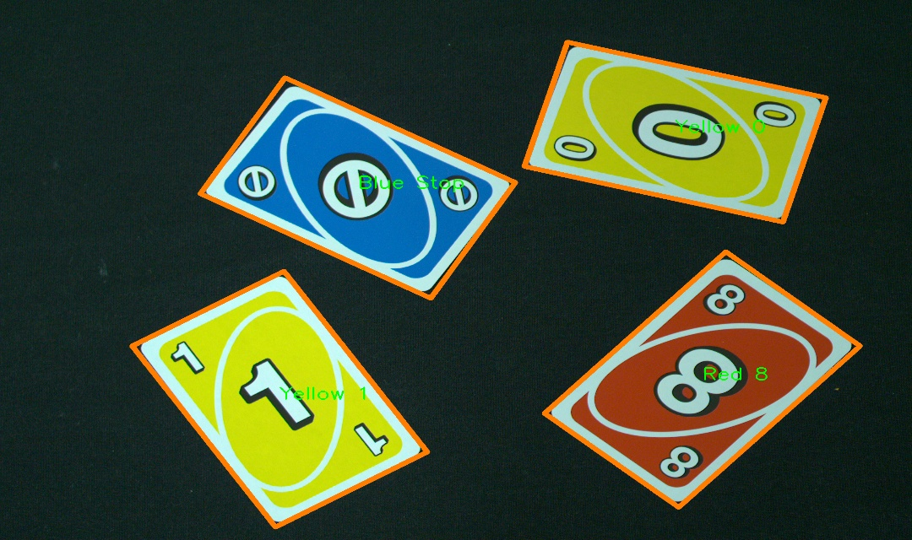

# Uno-cards-recognizer

## Table of Contents

- [Project Overview](#project-overview)
- [Features](#features)
- [Demo](#demo)
- [Technologies Used](#technologies-used)
- [Installation](#installation)
- [Usage](#usage)
- [How It Works](#how-it-works)
- [License](#license)
- [Acknowledgements](#acknowledgements)

## Project Overview

**Uno-cards-recognizer** is a computer vision application developed as a student project in C++ using OpenCV. 
The goal was to create a system capable of recognizing and identifying four UNO cards placed on a black table. 
Due to its academic nature, the project emphasizes fundamental techniques, resulting in a straightforward yet effective implementation. 
The system accurately detects the cards' positions, determines their colors and symbols without relying on image comparison techniques. 
It leverages image preprocessing, contour detection, perspective transformation, masking, and Hu Moments for symbol recognition.

## Features

- **Blur Detection:** Automatically detects and handles blurred images to ensure accurate card recognition.
- **Contour Detection:** Identifies the boundaries of UNO cards using contour analysis.
- **Perspective Transformation:** Corrects the orientation of detected cards for consistent analysis.
- **Symbol Recognition:** Utilizes Hu Moments to accurately determine the symbol on each card.
- **Color Detection:** Analyzes color channels to identify the card's color (Red, Green, Blue, Yellow).
- **Visualization:** Draws contours around detected cards and labels them with their identified color and symbol.
- **Output Saving:** Saves the processed image with detected cards and labels.

## Demo



*Sample output showing detected UNO cards labeled with their respective colors and symbols.*

## Technologies Used

- **Programming Language:** C++
- **Libraries:** OpenCV (version compatible with your system)
- **Development Environment:** Any C++ compatible IDE or text editor

## Installation

### Prerequisites

- **C++ Compiler:** Ensure you have a C++ compiler installed (e.g., GCC, Clang).
- **OpenCV:** Install OpenCV library (version 3.x or higher recommended).

### Installing OpenCV

#### On Windows:

1. Download the OpenCV pre-built libraries from the [official website](https://opencv.org/releases/).
2. Extract the downloaded archive to a directory of your choice.
3. Set up environment variables and include paths in your IDE.

#### On macOS using Homebrew:

brew install opencv
#### On Linux (Ubuntu):

```
sudo apt-get update
sudo apt-get install libopencv-dev
```
### Building the Project
#### 1.Clone the Repository:
```
git clone https://github.com/yourusername/uno-cards-recognizer.git
cd uno-cards-recognizer
```
#### 2.Compile the Code:

Using g++:
```
g++ -o uno_recognition main.cpp `pkg-config --cflags --libs opencv4`
```
Note: Replace opencv4 with opencv if using an older version.

#### 3.Ensure Image Resources are Available:

Place your UNO card images in the resources/ directory. The default image path in the code is resources/1.png. Ensure you have the necessary images or adjust the path accordingly.

## Usage
### Prepare the Image:

- **Place four UNO cards on a black table in a well-lit environment.
- **Ensure the cards are not overlapping and are fully visible.
- **Capture a clear image of the setup and save it in the resources/ directory (e.g., 1.png).
### Run the Application:

./uno_recognition
### View the Results:

   The application will display a window titled "Detected Cards" showing the original image with detected cards outlined and labeled with their identified color and symbol.
   It will also save the processed image as resources/3_detected.jpg.
## How It Works
### 1.Image Preprocessing:

   Converts the original image to grayscale.
   Detects if the image is blurred using the Laplacian method.
   Applies sharpening filters if the image is detected as blurred.
   Performs Canny edge detection to highlight edges.
### 2.Contour Detection and Warping:

   Identifies contours in the edge-detected image.
   Filters contours based on area to detect potential UNO cards.
   Draws contours around detected cards.
   Applies perspective transformation to obtain a top-down view of each card.
### 3.Masking:

   Applies a circular mask to each warped card image to isolate the symbol area.
### 4.Symbol Recognition:

   Computes Hu Moments for the masked area to identify the card's symbol (e.g., "0", "1", "8", "Reverse", "Stop").
### 5.Color Detection:

   Analyzes the average intensity of the Blue, Green, and Red channels to determine the card's color.
### 6.Visualization:

   Labels each detected card with its identified color and symbol.
   Displays and saves the final annotated image.

## License
   This project does not include a license file. If you intend to share or distribute your project, it's recommended to add a license to clarify usage rights. 
   You can choose a license such as MIT License, Apache License 2.0, or others based on your preference.

## Acknowledgements
   OpenCV: For providing powerful computer vision libraries that made this project possible.
   UNO Game: For being the inspiration behind this card recognition system.
   Academic Guidance: Special thanks to the faculty and peers from the third year of studies who contributed to the project's development.

